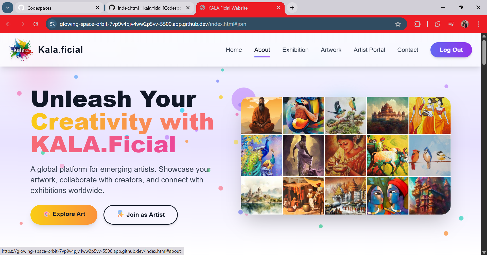
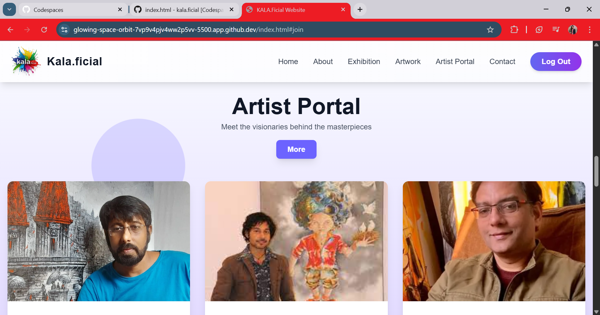
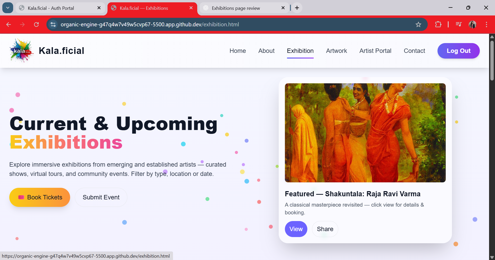
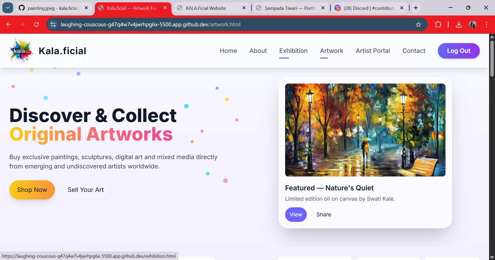
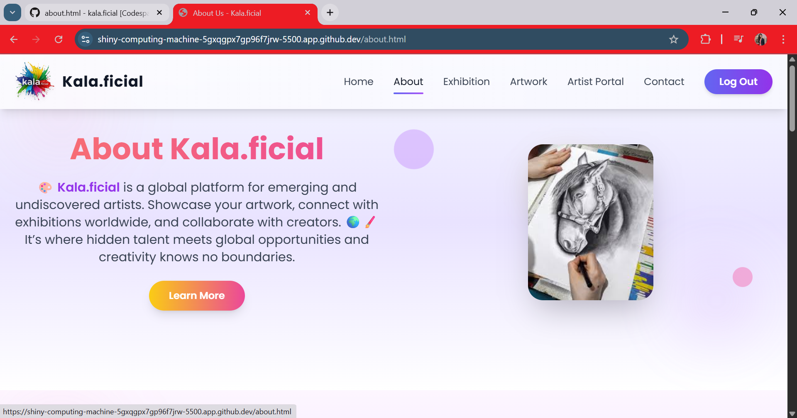
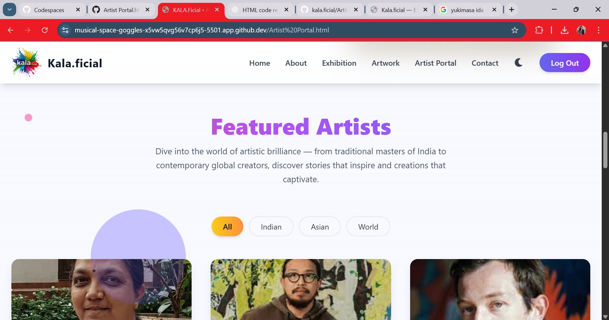
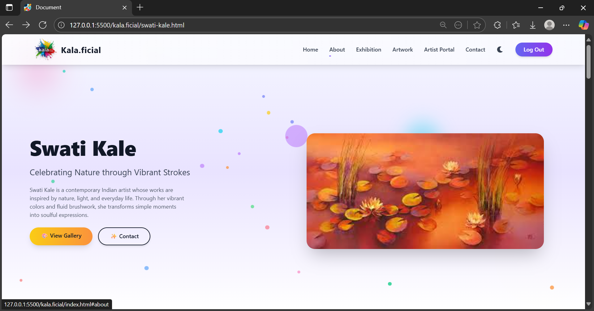
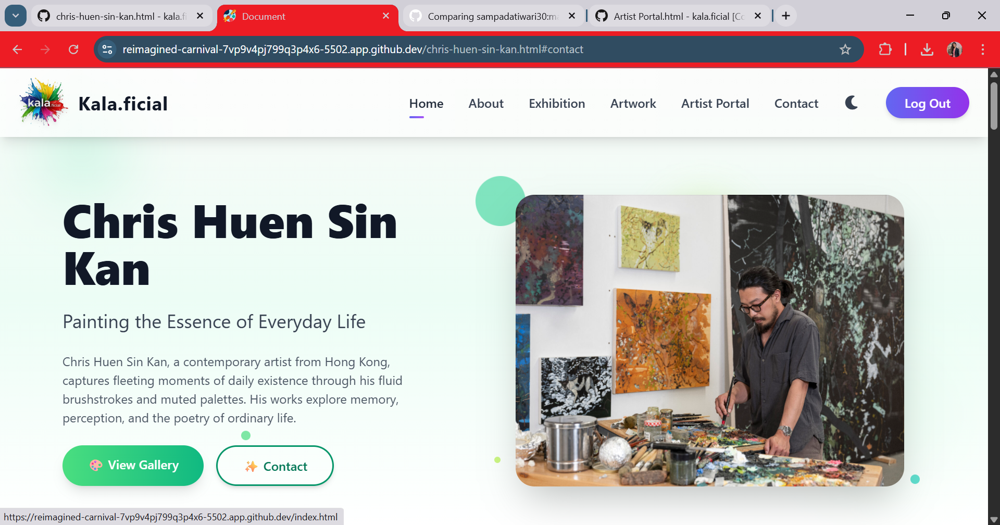

<a name="top"></a>

<h1 align="center"> kala.ficial </h1>


<a href="https://github.com/sampadatiwari30/kala.ficial/blob/main/LICENSE"></a>

<a href="https://github.com/sampadatiwari30/kala.ficial"></a>
 


<h2>📖 Table of Contents</h2> 

- <a href="#overview"> Overview </a>
- <a href="#project-insights"> Project Insights </a>
- <a href="#screenshots">Screenshots</a>
- <a href="#contribution-guidelines">Contribution Guidelines</a>
- <a href="#acknowledgments">Acknowledgments</a>
- <a href="#submitting-pull-request">Submitting a Pull Request</a>
- <a href="#contact">Contact</a>
- <a href="#how-to-contribute">How to Contribute</a>
- <a href="#contributing">Contributing</a>
- <a href="#code-of-conduct">Code of Conduct</a>
- <a href="#contribution">Contribution </a>
- <a href="#suggestions-feedback"> Suggestions & Feedback</a>
- <a href="#show-your-support">Show Your Support</a>
- <a href="#license">License</a>
- <a href="#stargazers">Stargazers</a>
- <a href="#forkers">Forkers</a>
- <a href="#project-admin">Project Admin</a>


<h2 id="overview">🔍 Overview</h2>

> 🎨Kala.ficial is a global platform designed to empower emerging and undiscovered artists by giving them a digital stage to showcase their creativity. Through curated online and offline exhibitions, artists can present their work to a worldwide audience, connect with fellow creators, and collaborate across borders.
>Our mission is to bridge the gap between hidden talent and global recognition — helping artists gain visibility, discover opportunities, and grow their artistic journey. 🌍✨
>Whether you’re an aspiring artist or an art enthusiast, Kala.ficial is your gateway to a thriving creative community — where art meets opportunity and passion finds purpose. 🖌️💫


<div align="center">
  
</div>


<h2 id="project-insights">📊 Project Insights</h2>

<table align="center">
    <thead align="center">
        <tr>
            <td><b>🌟 Stars</b></td>
            <td><b>🍴 Forks</b></td>
            <td><b>🐛 Issues</b></td>
            <td><b>🔔 Open PRs</b></td>
            <td><b>🔕 Closed PRs</b></td>
            <td><b>🛠️ Languages</b></td>
            <td><b>👥 Contributors</b></td>
        </tr>
     </thead>
    <tbody>
         <tr>
            <td></td>
            <td></td>
            <td></td>
            <td></td>
            <td></td>
            <td></td>
            <td></td>
        </tr>
    </tbody>
</table>


<h2 id="demo">🚀 Live Demo</h2>

Experience kala.ficial live here:
<br>
👉 [](https://sampadatiwari30.github.io/kala.ficial/)


<h2 id="screenshots"> 📸 Screenshots </h>











<h2 id="project-structure">📁 Project Structure</h2>

```bash
kala.ficial/
│
├── CODE_OF_CONDUCT.md
├── CONTRIBUTING.md
├── LICENSE
├── assets /
├── about.html
├── contact.html
├── exhibition.html
├── Artist Portal.html
├── blog.html
├── auth.html
├── exhibition.html
├── faq.html
├── privacy.html
├── sitemap.html
├── terms.html
├── test.html
├── theme-test.html
├── artist.html
├── theme-toggle.js
├── swati-kale.html
├── you.html
├── chris-huen-sin-kan.html
├── index.html
├── README.md
```

**🌟 Exciting Announcement!**

🚀 *Kala.ficial* is proud to announce that it has been officially selected as part of GirlScript Summer of Code (GSSoC) 2025! 💃🎉💻

We’re beyond thrilled to welcome passionate contributors from across India and around the world to collaborate, innovate, and grow with us.
Together, let’s make art, technology, and creativity more accessible than ever before! 🌍🖌️

**👩‍💻 About GSSoC**

GirlScript Summer of Code (GSSoC) is one of *India’s largest open-source programs* — a 3-month journey that empowers developers of all skill levels to contribute to real-world projects while learning, collaborating, and growing together. 🌱

It’s more than just coding — it’s about community, creativity, and contribution! 💡

**🌈 Why Contribute to GSSoC × Kala.ficial?**

By joining GSSoC 2025, contributors will get a chance to:
-✨ Enhance their technical and creative skills
-🤝 Collaborate on impactful open-source projects
-🏆 Get recognized for their valuable contributions
-📜 Earn certificates, swags, and community exposure
-💡 Be part of a vibrant art-tech community that bridges creativity with innovation
-🎉 Let’s Build the Future of Art-Tech Together!

We’re incredibly excited to welcome GSSoC’25 contributors to the Kala.ficial project family.
Let’s build, learn, and grow together — one commit at a time. 🔥👩‍💻👨‍💻


<h2 id="contribution-guidelines">Contribution Guidelines📑</h2> 

**We’re excited to have you contribute to Kala.ficial! Follow these simple steps to get started:**

⭐ Star the repository to show your support.

- Fork the repository and create a new branch for your updates, fixes, or features.
- Start coding and make your changes.
- Commit your updates with clear, descriptive messages.
- Create a Pull Request (PR) — our team will review it and share feedback or suggestions for improvement.
- Don’t forget to add screenshots or updated website links to help us understand your changes better.


**💜 Contributing is Fun!**

We welcome all contributions and ideas — whether it’s adding a new feature, improving design, fixing bugs, or enhancing documentation.

Your voice matters, and your insights help make Kala.ficial even better.
For any queries, feedback, or suggestions, feel free to reach out to the project maintainers or open a discussion.

Together, let’s create something meaningful and inspiring! 🌈


<h2 id="acknowledgments">🙏 Acknowledgments</h2>

- A heartfelt thank you to everyone who has contributed to this project — your efforts make a real difference!

**Special appreciation to GirlScript Summer of Code (GSSoC’25) 💫**
for providing an incredible platform, community, and support system that encourages collaboration and learning.

Built with dedication, teamwork, and plenty of ☕ chai moments. 💻💜


<h2 id="submitting-pull-request">📥 Submitting a Pull Request</h2>

Follow these steps to contribute your changes to **kala.ficial**:

**1. 🌟 Star & Fork the Repository**  

   Click the **“Star”** button to support the project, then **“Fork”** the repo to create your own copy:  
   <br>
   👉 [https://github.com/sampadatiwari30/kala.ficial](https://github.com/sampadatiwari30/kala.ficial)

**2. 📥 Clone Your Fork**  
<br>
   Use the following command to clone your forked repository to your local machine:

```bash
git clone https://github.com/Your-Username/kala.ficial.git
```

 **3. Create a Branch**
 <br>
 Navigate to the project directory and create a new branch for your changes:
 
```bash
cd kala.ficial
git checkout -b my-feature-branch
```

 **4. Make Changes**
 
 - Add your new ML projects, games, websites, or enhancements. Fix bugs or improve UI/UX as needed.

 **5. Commit Your Changes**
 <br>
 Use a meaningful commit message:
 
 ```bash
git add .
git commit -m "📦 [Feature Add] Add XYZ website project"
```

 **6. Push Your Changes**
 <br>
 Push your branch to your GitHub fork:
 
 ```bash
git push origin my-feature-branch
```
    
 **7. Submit a Pull Request**
 
 - Go to your fork on GitHub.
 - Click "Compare & pull request".
 - Add a descriptive title using one of the prefixes: [UI], [UX], [Feature Add].
 - Link the related issue (if any) and clearly describe your changes.


<h2 id="contact">📞 Contact</h2>

- **GitHub Issues**: [Report bugs or request features](https://github.com/sampadatiwari30/kala.ficial/issues)
- **Email**: Contact the maintainers for collaboration opportunities
  


<h2 id="how-to-contribute">🤝How to Contribute</h2>

We love contributions from the community! Whether it's a bug report, a new feature, or a documentation improvement, we appreciate your help.

***How to Contribute***

1.  **Fork the repository** and create a new branch for your changes.
2.  **Make your changes** and ensure everything is working as expected.
3.  **Submit a pull request** with a clear description of your changes.

***Found a Bug?***

-   Check the [issue tracker](https://github.com/sampadatiwari30/kala.ficial/issues) to see if the bug has already been reported.
-   If not, open a new issue and provide as much detail as possible.

***Have a Feature Idea?***

-   We'd love to hear it! Open an issue to discuss your idea.


<h2 id="contributing">🤝 Contributing</h2>

We welcome contributions from developers of all skill levels! Here are some ways you can contribute:

### Ways to Contribute

- 🐛 **Report Bugs** - Found an issue? Let us know!
- 💡 **Suggest Features**- Suggest and implement new functionality
- 📝 **Improve Documentation** - Help make our docs better
- 🎨 **UI/UX improvements** - Make the platform more user-friendly
- ⚡ **Performance Optimizations** - Help make kala.ficial faster and more efficient
- 📱 **Mobile responsiveness** - Improve the mobile experience
- 🔒 **Security enhancements** - Help keep user data safe

*Thank you to everyone who has made kala.ficial better! 💚*


<h2 id="code-of-conduct">📜 Code of Conduct</h2>

Please refer to the [`Code of Conduct`](https://github.com/sampadatiwari30/kala.ficial/blob/main/CODE_OF_CONDUCT.md) for details on contributing guidelines and community standards.


<h2 id="contribution">🤝👤 Contribution</h2>

We love our contributors! If you'd like to help, please check out our [`CONTRIBUTE.md`](https://github.com/sampadatiwari30/kala.ficial/blob/main/CONTRIBUTING.md) file for guidelines.

>Thank you once again to all our contributors who has contributed to **kala.ficial!** Your efforts are truly appreciated. 💖👏

<!-- Contributors badge (auto-updating) -->

[](https://github.com/sampadatiwari30/kala.ficial/graphs/contributors)

<!-- Contributors avatars (auto-updating) -->
<p align="left">
  <a href="https://github.com/sampadatiwari30/kala.ficial/graphs/contributors">
    
  </a>
</p>

See the full list of contributors and their contributions on the [`GitHub Contributors Graph`](https://github.com/sampadatiwari30/kala.ficial/graphs/contributors).


<h2 align="center">
<p style="font-family:var(--ff-philosopher);font-size:3rem;"><b> Show some  by starring this awesome repository!
</p>
</h2>


<h2 id="suggestions-feedback">💡 Suggestions & Feedback</h2>

Feel free to open issues or discussions if you have any feedback, feature suggestions, or want to collaborate!


<h2 id="show-your-support">🙌 Show Your Support</h2>

*If you find kala.ficial project helpful, give it a star! ⭐ to support more such educational initiatives:*

- ⭐ **Starring the repository**
- 🐦 **Sharing on social media**
- 💬 **Telling your friends and colleagues**
- 🤝 **Contributing to the project**


<h2 id="license">📄 License</h2>

This project is licensed under the MIT License - see the [`License`](https://github.com/sampadatiwari30/kala.ficial/blob/main/LICENSE) file for details.


<h2 id="stargazers">⭐ Stargazers</h2>

<div align="center">
  <a href="https://github.com/sampadatiwari30/kala.ficial/stargazers">
    
  </a>
</div>


<h2 id="forkers">🍴 Forkers</h2>

<div align="center">
  <a href="https://github.com/sampadatiwari30/kala.ficial/members">
    
  </a>
</div>


<h2 id="project-admin" align="center">🧑‍💻Project Admin:</h2>
<table>
<tr>
<td align="center">
<a href="https://github.com/sampadatiwari30"></a><br><sub><b>Sampada Tiwari</b><br><a href="https://www.linkedin.com/in/sampada-tiwari-217123257/"></a>
</sub>
</td>
</tr>
</table>


<h2 align="center">👨‍🏫Mentors – kala.ficial (GSSoC'25)</h2>

| Role          | Name               | GitHub Profile                                      | LinkedIn Profile                                                        |
| ------------- | ------------------ | --------------------------------------------------- | ----------------------------------------------------------------------- |
| Mentor 1 | Gaincy Sharma |  [gaincyst](https://github.com/gaincyst) | [gaincy-sharma](https://www.linkedin.com/in/gaincy-sharma-33b38132a/) |


<h1 align="center"> Give us a Star and let's make magic! </h1>

<p align="center">
     
</p>


<h3 align="center"> 👨‍💻 Built with ❤️ by kala.ficial Team</h3>
<h4 align="center"> ❤️ Sampada Tiwari and Contributors ❤️ </h4>
<p align="center">
  <a href="https://github.com/sampadatiwari30/kala.ficial/issues">Open an Issue</a> | <a href="https://github.com/sampadatiwari30/kala.ficial">🌟 Star on GitHub</a> | <a href="https://sampadatiwari30.github.io/kala.ficial/">🚀 Live Demo</a> </p>


<p align="center">
  <a href="#top" style="font-size: 18px; padding: 8px 16px; display: inline-block; border: 1px solid #ccc; border-radius: 6px; text-decoration: none;">
    ⬆️ Back to Top
  </a>
</p>


> Ready to show off your coding achievements? Get started with **kala.ficial** today! 🚀
